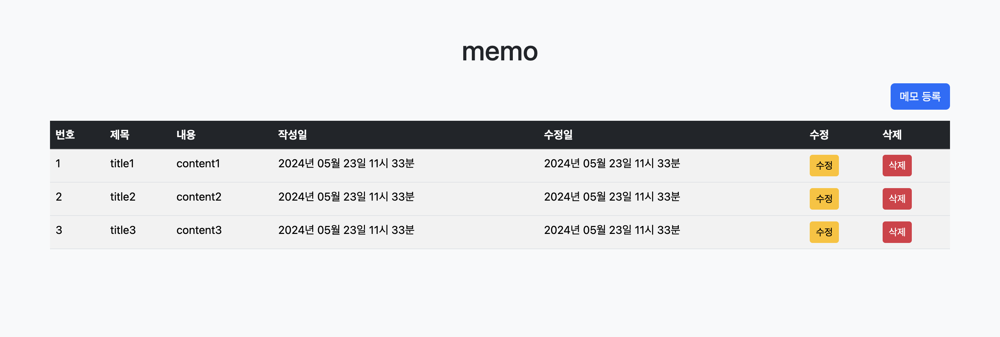
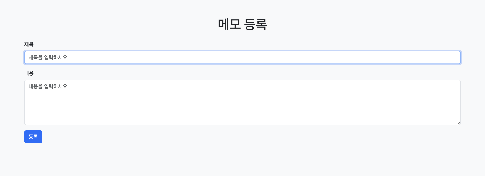
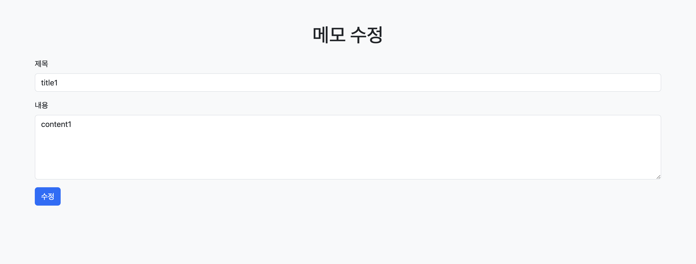
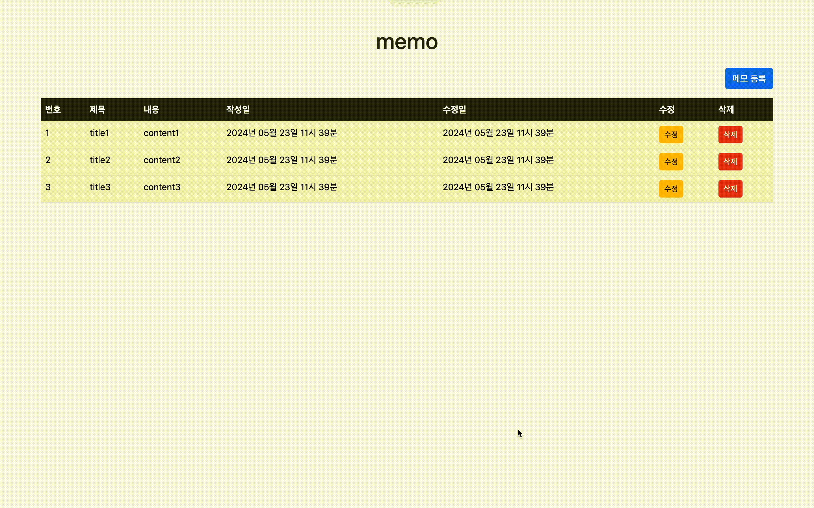

# 스프링 기반 간단 메모 웹 애플리케이션

> GDSC DEU 23-24 스프링부트 스터디 4주차 과제

## 개발 환경
- Java 17
- Spring Boot 3.2.5
- Thymeleaf
- Spring Data JPA
- H2 Database

**※ 객체지향의 개념을 이해하기 위해 일부러 Lombok을 사용하지 않았습니다 ※** 

## 기능

### 메모 조회

### 메모 추가

### 메모 수정

### 메모 삭제

